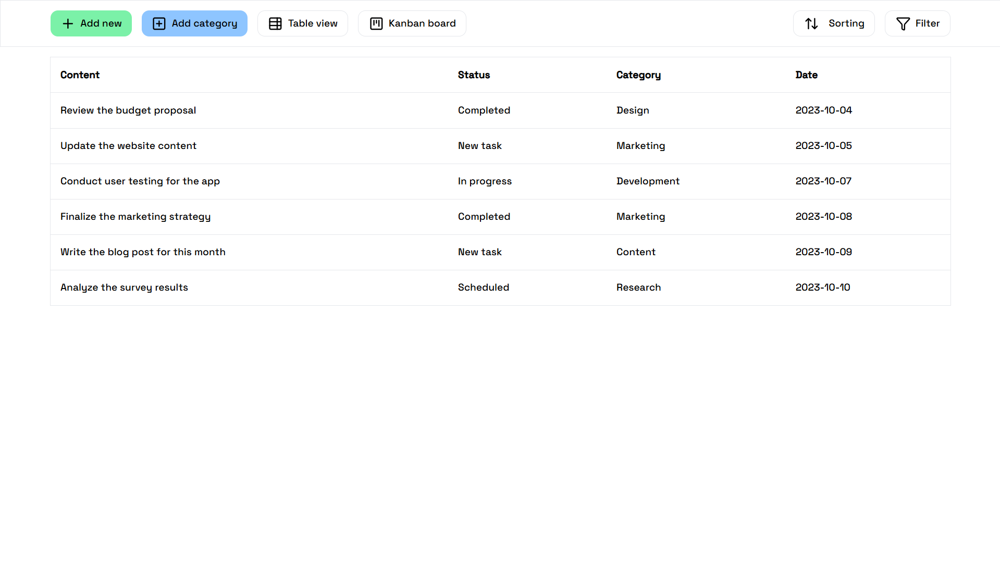
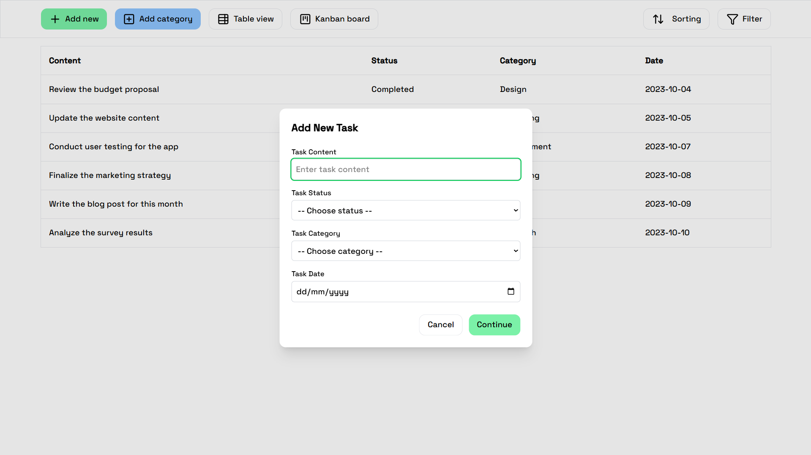
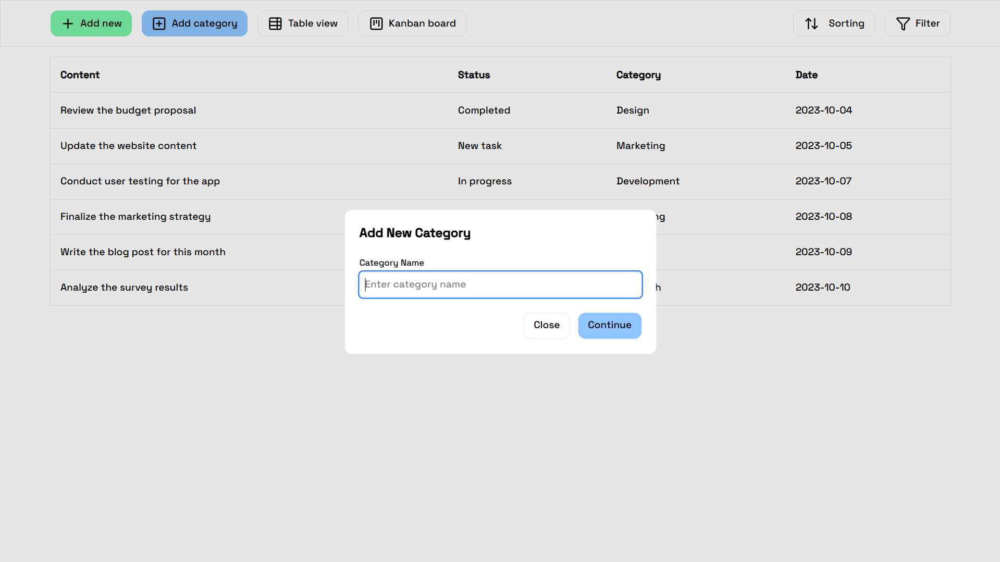
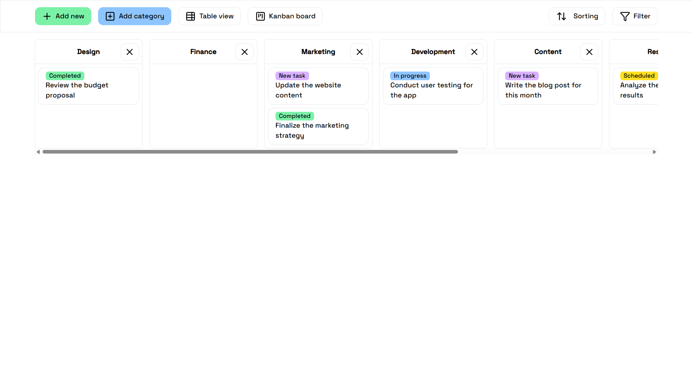
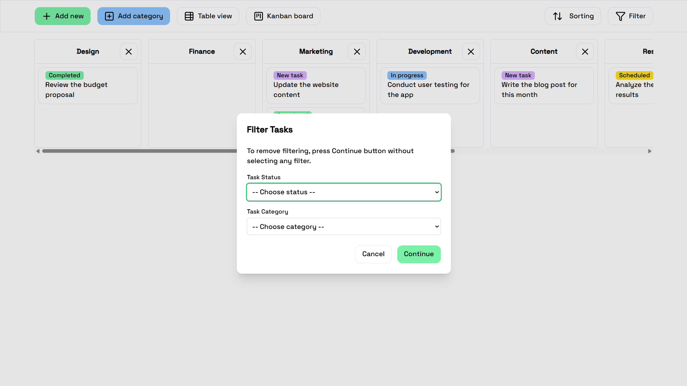
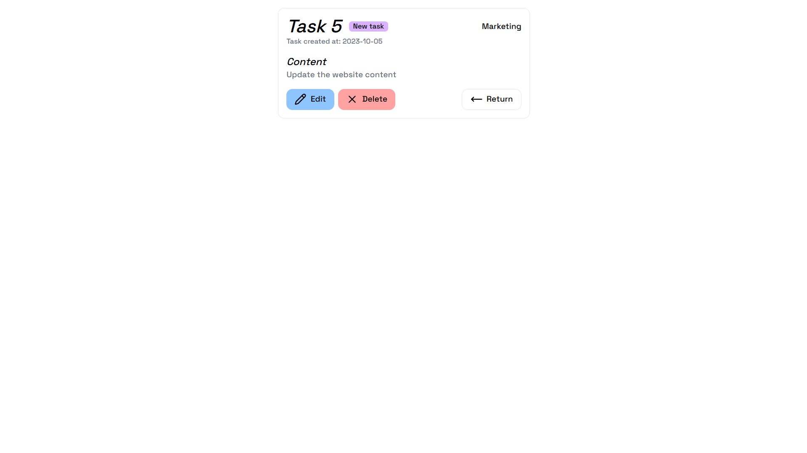
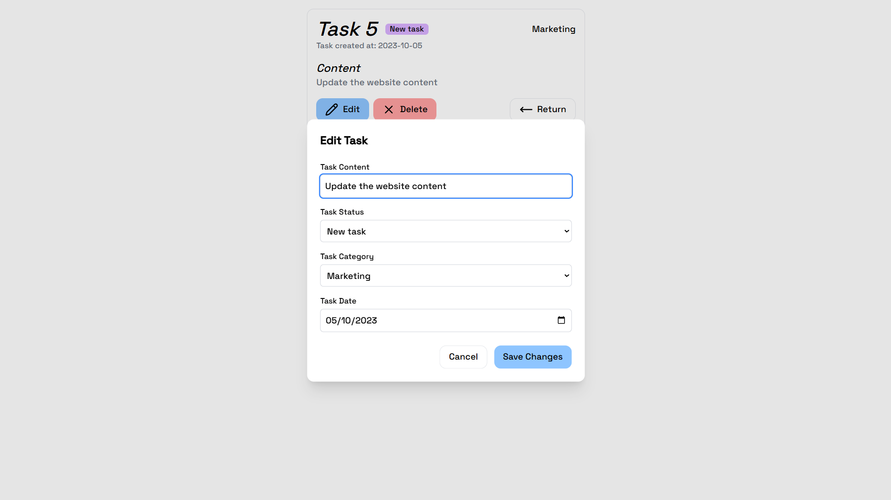
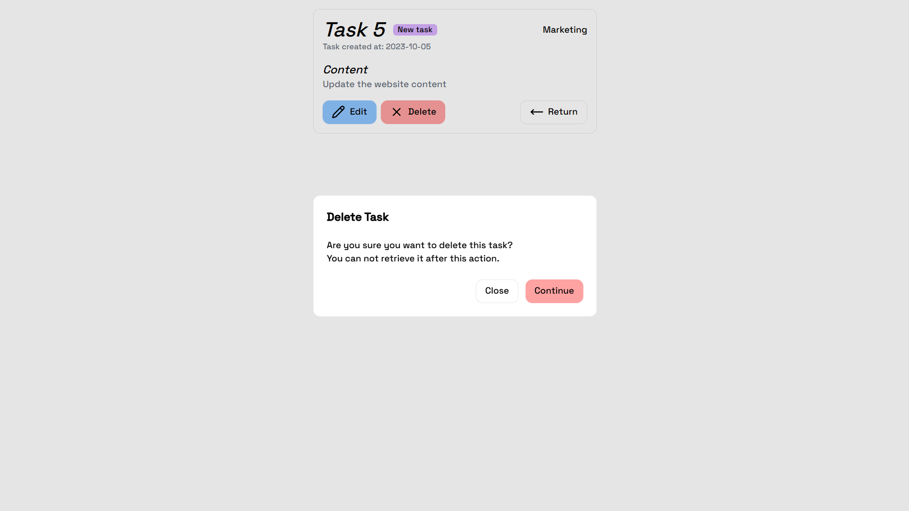
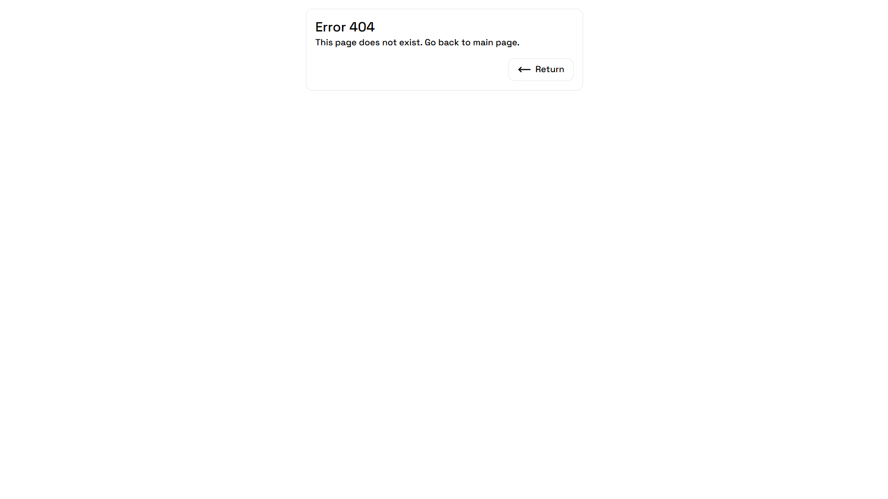
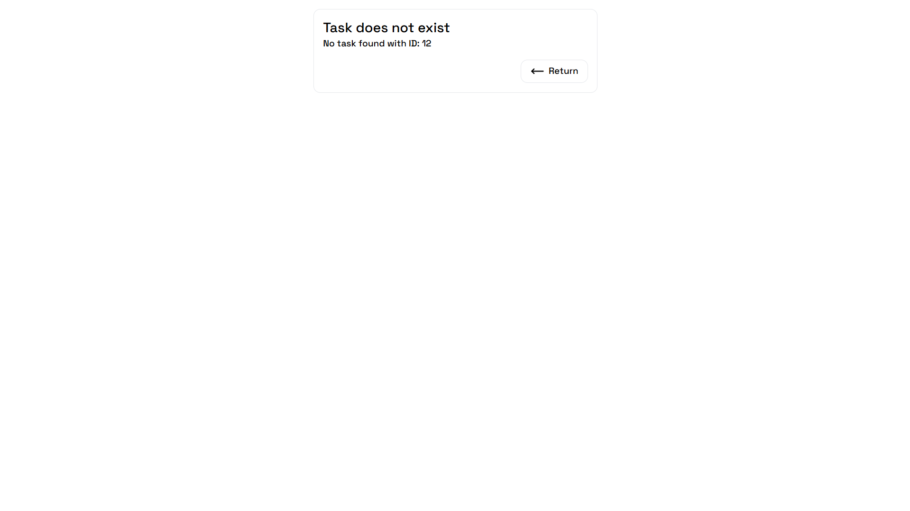

# Todo List

Happy Phone test task.

## Overview

The application allows users to create, edit, and manage tasks within user-defined categories. It supports two display modes: List and Kanban, with drag-and-drop functionality for task management.

## Features

1. Main Page (/)

- View Switcher: Toggle between List and Kanban views.
- Task Filtering: Filter tasks by status and category.
- Create Task Button: Button to create a new task.
- Create Category Button: Button to create a new category.
- Categories:
  - Create and delete categories with confirmation.
  - Display categories in the Kanban view.
  - Associate tasks with categories.
- List View:

  - Tasks are displayed in a vertical list.
  - Sorting options:
    - By creation date
    - Alphabetically
    - By status

- Kanban View:
  - Tasks are displayed in columns based on categories.
  - Supports drag-and-drop functionality between categories.

2. Task Editing Page (/task/[id])

- Allows users to:
  - Edit the task title, status, and category.
  - Delete the task with confirmation.

## Screenshots

  

  

  

  

